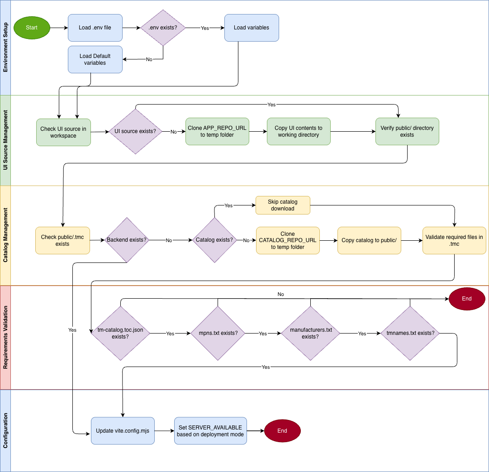

# TMC User Interface

The TMC User Interface is an open-source web interface for TMs managed by a TMC instance. The TMC instance URL is defined on the Settings page.
The initial goal is to support only GET requests in the UI; this is not a CLI replicated in a browser.

There are three use cases for this repository:

1. A TMC UI connected to a backend service without authentication.
2. A TMC UI connected to a backend service with authentication.
3. A TMC UI served as a static page, with TMs provided as static files. Note that some TMC UI features, such as filters, will not be available.

Deployment and setup for all three use cases can be handled by the `deploy.sh` file. This file is intended for use in GitLab CI/CD pipelines and GitHub workflows. It performs the checks required for deployment to GitLab Pages or GitHub Pages. More information is available in the [Deploy](#deploy) section.

The UI can be customized by following the instructions in the [Custom theme](#custom-theme) section.

Communication between applications in the WoT ecosystem, such as Editdor and Playground, uses the `postMessage` feature described in the [`postMessage` integration for external applications](#postmessage-integration-for-external-applications) section.

# Deploy

The deployment preparation flow is handled by `deploy.sh`. It reads the deployment settings defined in a `.env` file, ensures the application source is available, fetches the catalog when needed, validates the required files, and updates `vite.config.mjs` according to the selected deployment mode.

Inside the `ci-cd` folder are the files used by `deploy.sh`.

- `editConfig.sh`
- `fetchRepository.sh`
- `validateRequiredFiles.sh`

## Workflow of deploy.sh

## Instructions

Create a `.env` file at the repository root before running the script:

    APP_REPO_URL=https://github.com/<user_or_org>/<tmc-ui-repository>.git
    CATALOG_REPO_URL=https://github.com/<user_or_org>/<catalog-repository>.git
    SERVER_AVAILABLE=false

Variables:

- `APP_REPO_URL`: repository that contains the TMC UI source code. This is only used when the current workspace does not already contain `package.json` and `src`.
- `CATALOG_REPO_URL`: repository that contains the catalog content to be copied into `public`.
- `SERVER_AVAILABLE`: must be either `true` or `false`.
  - `false`: the UI is prepared as a static deployment and reads catalog files from the contents copied into `public`
  - `true`: the UI is prepared to work with a backend server, and the build configuration is updated accordingly

Run the deployment preparation step with:

    sh deploy.sh

The script performs the following steps:

1. Loads variables from `.env` if the file exists.
2. Checks whether the current workspace already contains the UI source.
3. If the UI source is missing, clones the repository defined in `APP_REPO_URL` into a temporary folder and copies its contents into the working directory.
4. Verifies that the `public` directory exists.
5. If `public/.tmc` already exists, skips the catalog download.
6. Otherwise, clones the repository defined in `CATALOG_REPO_URL` into a temporary folder and copies its contents into `public`.
7. Validates that the catalog contains all required files under `.tmc`.
8. Updates `vite.config.mjs` so `SERVER_AVAILABLE` matches the selected deployment mode.

If `.env` is not present, `deploy.sh` falls back to these defaults:

    APP_REPO_URL=https://github.com/wot-oss/tmc-ui.git
    CATALOG_REPO_URL=https://github.com/wot-oss/example-catalog.git
    SERVER_AVAILABLE=false

#### GitHub Pages configuration

- Set up GitHub Pages under **Settings** -> **Environments** -> **github-pages**
- Under **Deployment branches**, select the branch that should publish the site

Detailed documentation is available [here](https://docs.github.com/en/pages/getting-started-with-github-pages/configuring-a-publishing-source-for-your-github-pages-site).

The GitHub Pages workflow for this repository is defined in `.github/workflows/fetch-files.yml`.

#### Catalog repository requirements

The catalog repository must contain a `.tmc` directory at its root.

Inside `.tmc`, the following files are required:

- `tm-catalog.toc.json`
- `tmnames.txt`
- `mpns.txt`
- `manufacturers.txt`

Notes:

- The catalog validation step fails if any of the required files are missing.
- The helper script removes `.git`, `.gitignore`, `.github`, and `README.md` from downloaded repositories before copying them into the workspace.
- `SERVER_AVAILABLE` only accepts the values `true` or `false`.

## Application Modes

### Static

A static application mode will have all the catalog files deployed on the public folder, exacly the same way as a deploy on github or gitlab pages.

For this mode, the .env file requirements will be (example values), variables with values will mean they are mandatory:

    APP_REPO_URL=https://github.com/wot-oss/tmc-ui.git
    CATALOG_REPO_URL=https://github.com/wot-oss/example-catalog.git
    SERVER_AVAILABLE=false

### Backend with no auth

    APP_REPO_URL=
    CATALOG_REPO_URL=
    SERVER_AVAILABLE=true
    VITE_TOKEN_URL=
    VITE_SERVER_URL=https://server.url

If no value is defined in VITE_SERVER_URL the default value will be http://localhost:8080

### Backend with Auth

This UI supports OAuth2 client-credentials authentication for protected catalog backends.

Use this mode when the backend requires an access token before serving catalog or Thing Model data.

    APP_REPO_URL=
    CATALOG_REPO_URL=https://github.com/wot-oss/example-catalog.git
    SERVER_AVAILABLE=false
    VITE_TOKEN_URL=https://server/oauth/token
    VITE_SERVER_URL=https://server.cloud

### Other variables supported in the `.env` file

To add to the previous sections, the .env file can also have the following variables:

    VITE_EDITDOR_URL=https://eclipse-editdor.github.io/editdor/
    VITE_PLAYGROUND_URL=https://playground.thingweb.io/
    VITE_SETUP_CREDENTIALS_MESSAGE=

- `VITE_SETUP_CREDENTIALS_MESSAGE`="My Message": Additional text shown in the setup credentials screen. This can be used to provide operator instructions such as who to contact for access.

- `VITE_EDITDOR_URL` and `VITE_PLAYGROUND_URL` are used to configure the application behavior when the user wants to open the Thing Description in another application for editing and validation. The value of each variable defaults to the value shown above when the variable is not present in the `.env` file.

These two options are displayed in the Details page.

The `Open with` action can integrate with an external application by using `window.postMessage`.

#### Startup flow

When authentication is enabled, the UI validates credentials before granting access to the catalog.

On startup, the UI behaves as follows:

1. If valid credentials are already stored for the current browser tab, the UI validates them against the configured token endpoint before loading the catalog.
2. If no stored credentials are available, or if validation fails, the UI shows the setup screen and blocks access until the user provides valid credentials.
3. A failed validation keeps the user on the setup form and shows the returned error message.

#### Credential persistence and token handling

- Closing the tab clears the stored credential session.
- The access token is kept in memory and is not persisted in browser storage.
- The Settings page allows users to review and replace the current credentials during the session.

#### Example minimal local configuration

Create a local `.env` file with the following keys:

    SERVER_AVAILABLE=true
    VITE_TOKEN_URL=https://auth.example.local/oauth/token
    VITE_SERVER_URL=https://api.example.local

# Development

## Prerequisites

- Node.js >= 22.20.0
- Yarn

## Local Setup

If you wish to have a local setup, you only need to have the `setup-local.sh` file, `deploy.sh` file, a `.env` file and the `ci-cd` folder in the current folder.

Edit the `.env` file, and then run:

    sh setup-local.sh

It will automatically install, build and give a preview of the current application.

The `setup-local.sh` script does the following:

1. Checks that Node.js `>= 22.20.0` is installed.
2. Checks whether Yarn is available.
3. Runs `deploy.sh` only when the project files or catalog files still need to be prepared.
4. Runs `yarn install && yarn build && yarn preview`.

## Formatting

Run to check the code style for errors:

    yarn format:check

To format and fix the errors:

    yarn format

# `postMessage` integration for external applications

When the user clicks **Open with** and chooses the application configured through `VITE_EDITDOR_URL`, the UI opens that application in a new window and waits for a ready message from it.

To support this flow, the receiving application must implement the following handshake:

1. After the external application finishes loading, it must send a message to the opener window:

   window.opener?.postMessage({ type: 'EDITDOR_READY' }, '<tmc-ui-origin>');

2. After that message is received, this UI sends a second message back to the external application window with the Thing Description content:

   {
   type: 'LOAD_TD',
   description: '<thing-title-or-id>',
   payload: '<thing-description-json>'
   }

Message fields:

- `type`: message identifier.
- `description`: Thing Description title when available, otherwise the Thing Description `id`.
- `payload`: the full Thing Description serialized as formatted JSON.

The receiving application must listen for the `LOAD_TD` message and parse `payload` as JSON before loading it into its editor.

Security recommendations:

- Validate `event.origin` before accepting messages.
- Reply only to the opener window that created the external application window.
- Use the origin part of the configured URLs when calling `postMessage`, not the full URL including the path.

The UI waits up to 10 seconds for the `EDITDOR_READY` message. If no ready message is received within that time, the action is marked as failed.

# Custom theme

Customize the colors of the UI by editing the CSS variables in `src/theme.css`.

Theme structure:

- Shared values used by both themes live in `:root`
- Dark theme defaults live in `:root, html.dark`
- Light theme overrides live in `html.light`

All color values must be specified in hexadecimal format. Shared variables declared in `:root` are inherited by both themes unless they are overridden in `html.dark` or `html.light`.

Variables (edit in `src/theme.css`):

1. Surface

- `--color-surface-canvas`: page background
- `--color-surface-panel`: panel and card background
- `--color-surface-panel-hover`: panel hover background
- `--color-surface-panel-active`: active panel background
- `--color-surface-modal`: modal and dialog background
- `--color-surface-input`: input background
- `--color-surface-input-hover`: input hover background

2. Media

- `--color-media`: neutral media/background fill

3. Text

- `--color-text-primary`: primary text color
- `--color-text-secondary`: secondary text color
- `--color-text-tertiary`: tertiary text color
- `--color-text-inverse`: text color for inverse surfaces
- `--color-text-inverse-strong`: stronger inverse text color
- `--color-text-muted-light`: muted light text
- `--color-text-marker`: marker and disabled indicator text

4. Border

- `--color-border-default`: default border color
- `--color-border-subtle`: subtle divider and border color
- `--color-border-focus`: focus border color
- `--color-border-accent`: accent border color
- `--color-border-interactive`: default interactive border color
- `--color-border-interactive-hover`: interactive border hover color
- `--color-border-interactive-pressed`: interactive border pressed color

5. Interactive

- `--color-interactive-primary`: primary interactive color
- `--color-interactive-hover`: interactive hover color
- `--color-interactive-pressed`: interactive pressed color
- `--color-interactive-support`: supporting interactive color
- `--color-interactive-support-hover`: supporting interactive hover color
- `--color-interactive-accent`: accent interactive color

6. Focus

- `--color-focus-ring`: focus ring color
- `--color-focus-soft`: softer focus accent color

7. Status

- `--color-status-success`: success color
- `--color-status-success-subtle`: subtle success background/tint
- `--color-status-success-outline`: success outline color
- `--color-status-error`: error color
- `--color-status-error-subtle`: subtle error background/tint
- `--color-status-error-hover`: error hover color
- `--color-status-error-outline`: error outline color
- `--color-status-error-strong`: stronger error background/accent
- `--color-status-error-soft`: softer error background/accent

8. Overlay

- `--color-overlay-backdrop`: overlay and modal backdrop color
- `--color-overlay-success-tint`: success overlay tint
- `--color-overlay-scroll-thumb`: scrollbar thumb color

9. Icon

- `--color-icon-brand`: brand icon color
